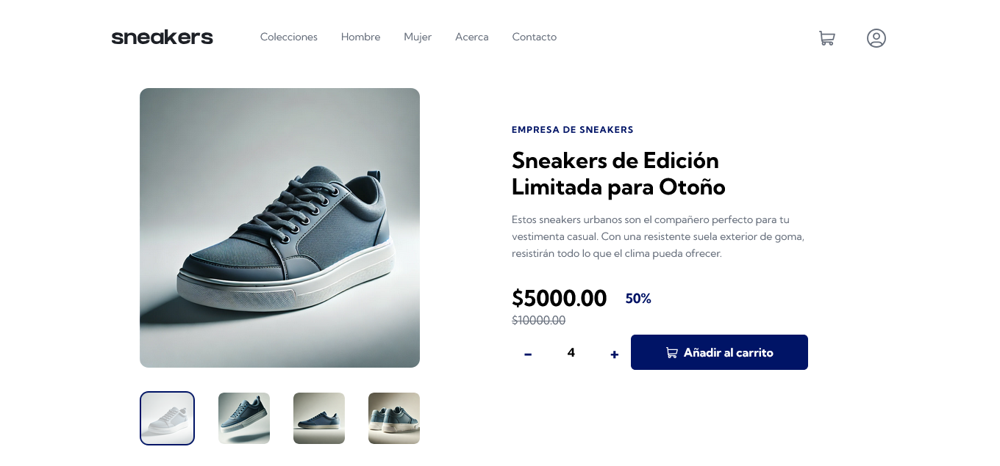
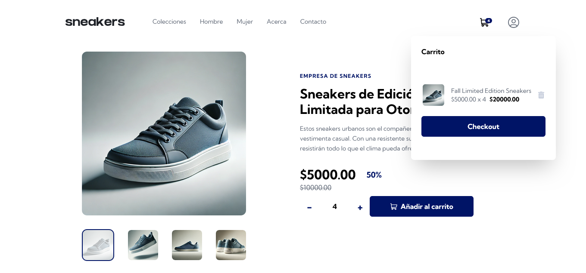
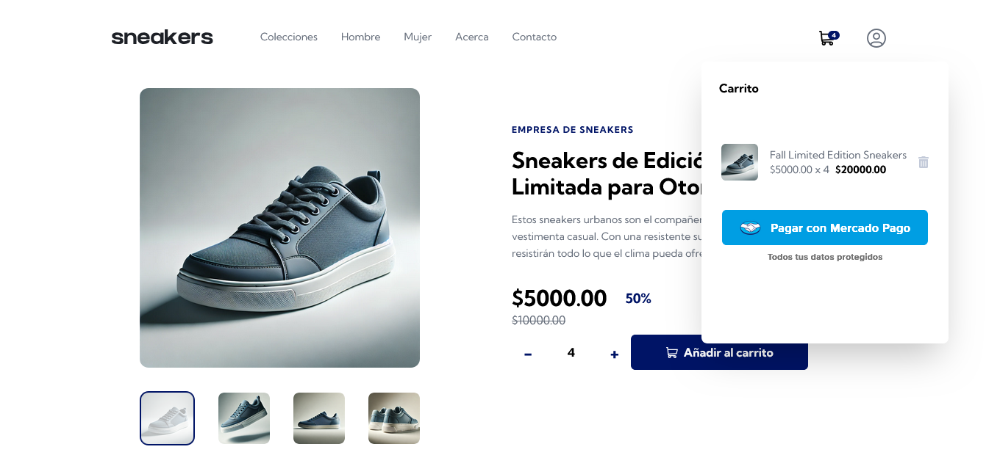
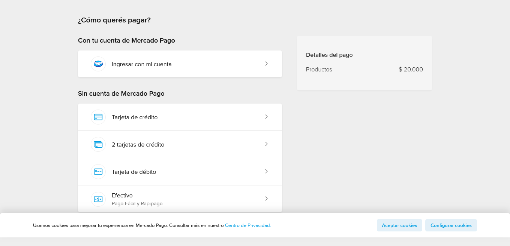
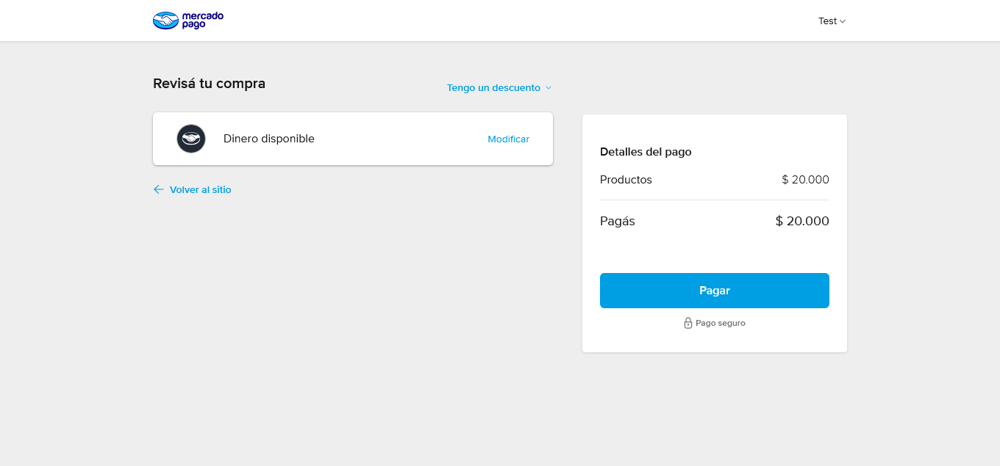
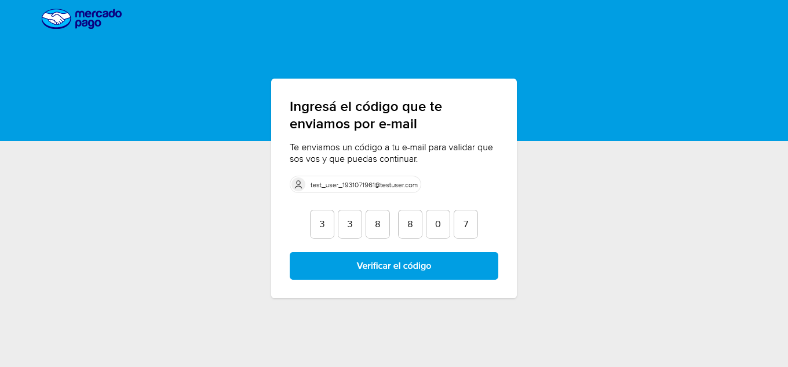
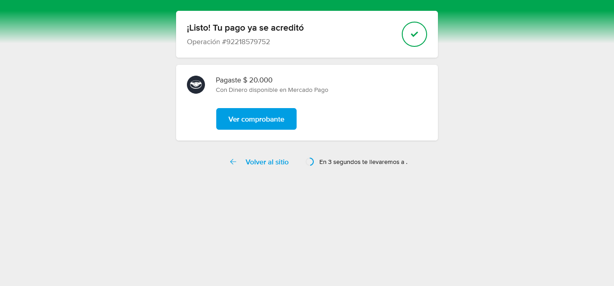

<p align="center">
  
</p>

<h1 align="center">Sneakers — Tienda de Zapatillas Urbanas</h1>

<p align="center">
  <strong>E-commerce de zapatillas urbanas de edición limitada con integración de pagos vía Mercado Pago.</strong>
</p>

<p align="center">
  
  
  
  
  
</p>

---

## 📋 Tabla de Contenidos

- [Descripción](#-descripción)
- [Demo](#-demo)
- [Características](#-características)
- [Tech Stack](#-tech-stack)
- [Arquitectura del Proyecto](#-arquitectura-del-proyecto)
- [Instalación y Uso](#-instalación-y-uso)
- [Flujo de Compra](#-flujo-de-compra)
- [Autor](#-autor)

---

## 📝 Descripción

**Sneakers** es una Single Page Application (SPA) de e-commerce diseñada para la venta de zapatillas urbanas de edición limitada. La aplicación ofrece una experiencia de usuario moderna y fluida, con diseño completamente responsivo (mobile-first) e integración completa con **Mercado Pago** para procesar pagos seguros.

---

## 🚀 Demo

|         Vista Desktop          |           Vista Mobile            |
| :----------------------------: | :-------------------------------: |
|  |  |

---

## ✨ Características

- 🛍️ **Catálogo de producto** con galería de imágenes interactiva
- 📱 **Diseño responsive** — slider táctil en mobile, galería con thumbnails y lightbox modal en desktop
- 🛒 **Carrito de compras** con modal desplegable, selector de cantidad y resumen de pedido
- 💳 **Checkout integrado** con Mercado Pago SDK (Wallet Brick)
- ⚡ **Loading states** con skeleton loaders durante la preparación del pago
- 🎨 **UI moderna** con Tailwind CSS, tipografía Kumbh Sans y transiciones suaves
- 🏗️ **Arquitectura limpia** — Context API para estado global, custom hooks, componentes modulares

---

## 🛠️ Tech Stack

### Frontend

| Tecnología                 | Propósito                                            |
| -------------------------- | ---------------------------------------------------- |
| **React 18**               | UI declarativa con componentes funcionales y hooks   |
| **TypeScript**             | Tipado estático para mayor robustez y autocompletado |
| **Vite** + SWC             | Build tool ultrarrápido con Hot Module Replacement   |
| **Tailwind CSS 3**         | Utility-first CSS para estilos responsivos           |
| **Mercado Pago SDK React** | Componente `Wallet` para flujo de pago seguro        |

### Backend (servicio externo)

| Tecnología            | Propósito                                         |
| --------------------- | ------------------------------------------------- |
| **Node.js + Express** | API REST para crear preferencias de pago          |
| **Mercado Pago SDK**  | Generación de preferencias de pago server-side    |
| **Vercel**            | Hosting del backend (`sneaker-server.vercel.app`) |

---

## 📁 Arquitectura del Proyecto

```
sneakers-ecommerce/
├── public/                      # Assets estáticos y screenshots
│   └── logo.svg
├── src/
│   ├── assets/                  # Imágenes de producto e iconos SVG
│   │   ├── image-product-{1-4}.webp
│   │   └── icon-*.svg
│   ├── components/
│   │   ├── Header/              # Navbar, menú hamburguesa, carrito
│   │   │   ├── Cart.tsx
│   │   │   ├── CartModal.tsx         # Modal del carrito + lógica MercadoPago
│   │   │   ├── CheckoutButton.tsx    # Botón de checkout con skeleton loader
│   │   │   ├── CheckoutCart.tsx
│   │   │   ├── CheckoutDetailProduct.tsx
│   │   │   ├── CheckoutDeleteButton.tsx
│   │   │   ├── MenuAndLogo.tsx
│   │   │   ├── MenuButton.tsx / MenuButtonClose.tsx
│   │   │   └── Nav.tsx
│   │   ├── ProductImage/        # Galería de producto
│   │   │   ├── MobileProductImage.tsx    # Slider con flechas prev/next
│   │   │   ├── DesktopProductImage.tsx   # Galería con thumbnails clickeables
│   │   │   ├── ProductThumbnailImage.tsx
│   │   │   ├── ThumbnailComponent.tsx
│   │   │   └── CloseModalButton.tsx
│   │   ├── ShoppingCart/        # Sección de compra
│   │   │   ├── ShoppingCartItem.tsx
│   │   │   ├── QuantityItems.tsx
│   │   │   ├── AddToCartButton.tsx
│   │   │   └── DetailsProduct.tsx
│   │   ├── ModalDesktopProduct.tsx   # Lightbox modal de producto
│   │   ├── Header.tsx
│   │   └── TextContent.tsx
│   ├── context/
│   │   ├── CartContext.tsx       # Estado global del carrito
│   │   └── UIContext.tsx         # Estado global de UI (menú, modal)
│   ├── hooks/
│   │   ├── useCart.ts            # Hook del carrito
│   │   ├── useCountProduct.ts   # Contador de cantidad
│   │   ├── useDesktopModal.ts   # Control del lightbox
│   │   ├── useItemsCart.ts      # Items del carrito
│   │   ├── useMenu.ts           # Estado del menú mobile
│   │   ├── useModalState.ts     # Estado del modal
│   │   ├── useResize.ts         # Detección de tamaño de pantalla
│   │   └── useSlider.ts         # Lógica del slider de imágenes
│   ├── types.ts                 # Interfaces TypeScript
│   ├── constants.ts             # Array de imágenes de producto
│   ├── App.tsx                  # Componente raíz
│   └── main.tsx                 # Entry point con providers
├── index.html                   # HTML template
├── vite.config.ts
├── tailwind.config.js           # Colores custom (blue, darkGrayishBlue)
├── tsconfig.json
└── package.json
```

---

## ⚙️ Instalación y Uso

### Prerrequisitos

- **Node.js** ≥ 18
- **pnpm** (recomendado) o npm

### Pasos

```bash
# 1. Clonar el repositorio
git clone https://github.com/gabrieloporto/sneakers-ecommerce.git
cd sneakers-ecommerce

# 2. Instalar dependencias
pnpm install

# 3. Iniciar servidor de desarrollo
pnpm dev
```

La aplicación estará disponible en `http://localhost:5173`.

### Scripts disponibles

| Comando        | Descripción                                         |
| -------------- | --------------------------------------------------- |
| `pnpm dev`     | Inicia el servidor de desarrollo con HMR            |
| `pnpm build`   | Compila TypeScript y genera el bundle de producción |
| `pnpm preview` | Previsualiza el build de producción                 |
| `pnpm lint`    | Ejecuta ESLint sobre el proyecto                    |

---

## 🛒 Flujo de Compra

### 1. Explorar el Producto

El usuario accede a la página principal donde visualiza el producto con una galería interactiva de imágenes. En **mobile** se navega con un slider (prev/next), y en **desktop** se seleccionan thumbnails con opción de abrir un lightbox modal.

<p align="center">
  
</p>

### 2. Agregar al Carrito

Se selecciona la cantidad deseada y se agrega al carrito. El ícono del carrito en el header muestra un badge con la cantidad de items.

### 3. Revisar el Carrito

Al hacer clic en el carrito se despliega un modal con el resumen del pedido: imagen del producto, nombre, precio unitario, cantidad y total. Se puede eliminar el item o proceder al checkout.

<p align="center">
  
</p>

### 4. Checkout con Mercado Pago

Al presionar **"Checkout"**, se genera una preferencia de pago en el backend y se renderiza el **Wallet Brick** de Mercado Pago. Un skeleton loader indica que el método de pago se está preparando.

<p align="center">
  
</p>

### 5. Completar el Pago

Para completar la compra, se debe iniciar sesión en Mercado Pago con la **cuenta de prueba** proporcionada:

| Campo                                         | Valor                |
| --------------------------------------------- | -------------------- |
| **Email**                                     | `TESTUSER1931071961` |
| **Contraseña**                                | `s8exV5kJnF`         |
| **Código de confirmación** (si es solicitado) | `338807`             |

**Pasos del proceso de pago:**

1. Inicia sesión con la cuenta de prueba de Mercado Pago.

   

2. Realiza el pago del producto.

   

3. Ingresa el código de verificación de 6 dígitos si es solicitado.

   

4. Una vez realizado el pago, el usuario es redirigido automáticamente a la página principal de la tienda.

   

### 6. Confirmación

Después de realizar el pago, el usuario es redirigido al inicio de la tienda, donde puede seguir explorando productos o realizar nuevas compras.

---

## 👤 Autor

Desarrollado por **[Gabriel Oporto](https://gabrieloporto.vercel.app)**.

<p align="center">
  <a href="https://github.com/gabrieloporto">
    
  </a>
</p>
