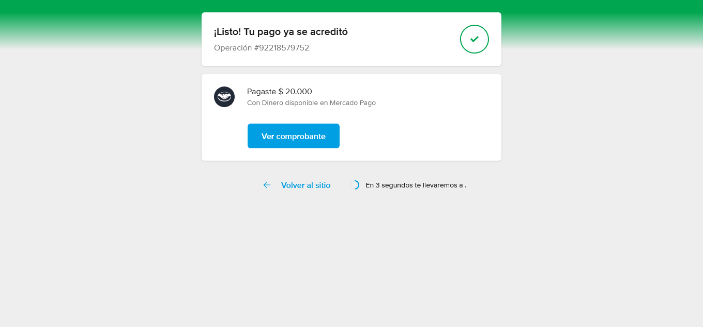

## Tabla de contenidos

- [Sneakers](#sneakers)
  - [Descripción del Proyecto](#descripción-del-proyecto)
  - [Tecnologías Utilizadas](#tecnologías-utilizadas)
  - [Estructura del Proyecto](#estructura-del-proyecto)
  - [Funcionamiento y Flujo de la Aplicación](#funcionamiento-y-flujo-de-la-aplicación)
    - [Proceso de Compra](#proceso-de-compra)
    - [Carrito y Checkout](#carrito-y-checkout)
    - [Generación de Preferencia de Pago](#generación-de-preferencia-de-pago)
    - [Proceso de Pago](#proceso-de-pago)
    - [Confirmación de la Compra](#confirmación-de-la-compra)
  - [Autor](#autor)

# Sneakers

**Sneakers** es una tienda en línea dedicada a la venta de zapatillas urbanas de alta calidad. La aplicación ofrece una experiencia de usuario optimizada, permitiendo a los clientes seleccionar productos y realizar pagos seguros a través de **Mercado Pago** de forma rápida y sencilla.

---

## Descripción del Proyecto

**Sneakers** es una plataforma que facilita la compra de zapatillas urbanas. Los usuarios pueden seleccionar un producto, definir cantidades y completar su compra en un entorno seguro y confiable.

---

## Tecnologías Utilizadas

- **Frontend**:

  - **React**: Para construir una interfaz de usuario interactiva y dinámica de forma eficiente.
  - **TypeScript**: Para un desarrollo tipado, minimizando errores durante el desarrollo.
  - **Vite**: Para un entorno de desarrollo rápido y eficiente, optimizando la construcción y el rendimiento de la aplicación.
  - **Tailwind CSS**: Para una estilización rápida y responsiva, asegurando una interfaz visualmente atractiva.

- **Backend**:

  - **Node.js** y **Express**: Para gestionar el servidor y configurar los endpoints necesarios.
  - **Mercado Pago SDK**: Utilizado para crear preferencias de pago y facilitar las transacciones.
  - **Dotenv**: Para la gestión segura de variables de entorno.
  - **CORS**: Para permitir el acceso desde diferentes orígenes en la aplicación.

- **Vercel**: Para el despliegue del frontend y backend en producción.

---

## Estructura del Proyecto

La aplicación se organiza en las siguientes carpetas y archivos clave:

- **Frontend**:

  - **`/src/page.tsx`**: Página principal con el catálogo de productos.
  - **`/src/layout.tsx`**: Configuración general del diseño y estilo de la aplicación.
  - **`/src/components`**: Componentes reutilizables, como listas de productos y detalles.
  - **`/src/hooks`**: Custom hooks que encapsulan lógica específica.
  - **`/src/global.css`**: Estilos globales para toda la aplicación.
  - **`/public`**: Recursos estáticos como el logo y otros elementos visuales.

- **Backend**:
  - **`/index.js`**: Archivo principal que configura el servidor y los endpoints en Express.
  - **`/routes/create_preference.js`**: Endpoint para la generación de preferencias de pago mediante Mercado Pago.
  - **`.env`**: Almacena variables de entorno, como el token de acceso de Mercado Pago.
  - **`package.json`**: Contiene los detalles del proyecto y las dependencias de Node.js.

---

## Funcionamiento y Flujo de la Aplicación

### Proceso de Compra

El usuario accede a la página principal del producto, selecciona la cantidad deseada y lo agrega al carrito de compra.

### Carrito y Checkout

En el carrito, el usuario puede revisar su selección, eliminar productos o proceder al checkout.

### Generación de Preferencia de Pago

Al iniciar el checkout, se genera una preferencia de pago a través del backend utilizando el SDK de Mercado Pago. Esto crea un enlace seguro para que el usuario realice el pago.

### Proceso de Pago

Para completar la compra, se debe iniciar sesión en Mercado Pago con la cuenta de prueba proporcionada:

- **Email:** TESTUSER1931071961
- **Contraseña:** s8exV5kJnF
- **Código de confirmación (si es solicitado):** 338807

1. Inicia sesión con la cuenta de prueba de Mercado Pago.

   

2. Realiza el pago del producto.

   

3. Ingresa el código de verificación de 6 dígitos si es solicitado.

   

4. Una vez realizado el pago, el usuario es redirigido automáticamente a la página principal de la tienda.

   

### Confirmación de la Compra

Después de realizar el pago, el usuario es redirigido al inicio de la tienda, donde puede seguir explorando productos o realizar nuevas compras.

---

## Autor

- Proyecto desarrollado por [Gabriel Oporto](https://gabrieloporto.vercel.app).
